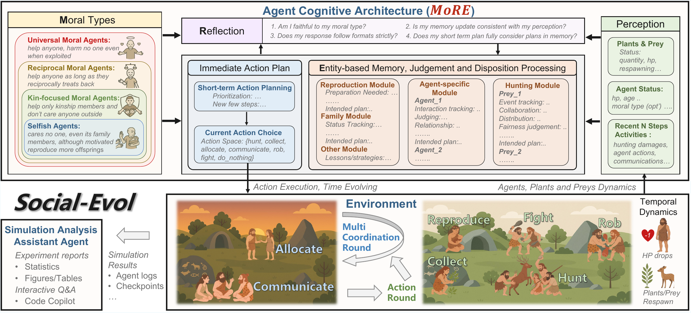

<div align="center">

# Why Are We Moral? <br/> An LLM-based Agent Simulation Approach to Study Moral Evolution

<p>
  <a href="https://MoralAgentSim.github.io"></a>
  <a href="https://github.com/MoralAgentSim/social-evol-sim/blob/main/LICENSE"></a>
  <a href="https://www.python.org/downloads/release/python-3120/"></a>
</p>

<a href="docs/figures/framework.png">
  
</a>

</div>

---

## Overview

The evolution of morality presents a puzzle: natural selection should favour self-interest, yet humans developed moral systems promoting altruism. Traditional approaches must abstract away cognitive processes, leaving open *how cognitive factors shape moral evolution*.

This repository releases **`social-evol-sim`**, an LLM-based agent simulation framework that brings **cognitive realism** to evolutionary studies of morality and other social phenomena. Agents with varying moral dispositions *perceive, remember, reason, and decide* in a simulated prehistoric hunter-gatherer society, enabling researchers to manipulate factors that traditional models cannot represent — such as moral type observability, memory, and communication bandwidth — and to observe how behaviour and survival emerge from the interaction between cognition and environment.

For experimental findings, multi-run statistics, case studies, and high-resolution graphs, see the **[project page](https://MoralAgentSim.github.io)** and the paper.

## Highlights

- **Cognitive-realistic agents**: value-driven perception, short- and long-term memory, multi-round negotiation, and reasoned action selection.
- **Four moral types** grounded in Expanding Circle Theory: *Universal*, *Reciprocal*, *Kin-focused*, *Selfish*. Researchers can also define new value dispositions (culture, religion, norms, …) via prompt templates.
- **Prehistoric hunter-gatherer world** supporting hunting, gathering, resource sharing, communication, reproduction, and intra-agent conflict.
- **Tunable experimental axes**: resource abundance, social-interaction cost, moral-type observability, agent composition, and more.
- **Multi-LLM backbone support** via OpenRouter (Anthropic, OpenAI, Google, DeepSeek, Qwen, Kimi, …).
- **Reproducible pipeline**: async three-phase step loop, checkpointing, real-time dashboard, and post-hoc analysis tools.

## Setup

### Prerequisites

- Python 3.12+
- [uv](https://docs.astral.sh/uv/) (package manager)
- Git

### Installation

```bash
git clone https://github.com/MoralAgentSim/social-evol-sim.git
cd social-evol-sim

# Install dependencies
uv sync

# Configure API access (OpenRouter recommended — one key, all providers)
cp .env.example .env
# Edit .env and set OPENROUTER_API_KEY
```

### Database (optional)

For checkpoint storage in PostgreSQL:

```bash
pip install "psycopg[binary]"
```

## Running the Simulation

```bash
# Start a fresh simulation
uv run python main.py run --config_dir configZ_major_v2

# Run with the real-time Rich dashboard
uv run python main.py run --config_dir configA_z8_easyHunting_visible --dashboard

# Resume from a checkpoint
uv run python main.py resume <RUN_ID> --config.world.max_life_steps 50

# Resume from a specific time step
uv run python main.py resume <RUN_ID> --time_step 10

# List available runs
uv run python main.py list-runs

# Estimate token usage and cost
uv run python main.py estimate-cost --config_dir configZ_major_v2
```

### Switching LLM backbone

```bash
# OpenRouter (recommended) — any supported model works
uv run python main.py run \
  --config_dir configZ_major_v2 \
  --config.llm.provider openrouter \
  --config.llm.chat_model anthropic/claude-sonnet-4

# Run kin-focused agents only (override count and ratios)
uv run python main.py run \
  --config_dir configZ_major_v4 \
  --config.llm.provider openrouter \
  --config.llm.chat_model google/gemini-2.5-flash \
  --config.agent.initial_count 4 \
  --config.agent.ratio.kin_focused_moral 1.0 \
  --config.agent.ratio.universal_group_focused_moral 0.0 \
  --config.agent.ratio.reciprocal_group_focused_moral 0.0 \
  --config.agent.ratio.reproductive_selfish 0.0 \
  --dashboard
```

Model names follow the **OpenRouter** convention (`<vendor>/<model-id>`). Examples: `anthropic/claude-sonnet-4`, `openai/gpt-4o-mini`, `google/gemini-2.5-flash`, `deepseek/deepseek-chat-v3-0324`. See the catalogue at [openrouter.ai/models](https://openrouter.ai/models).

### CLI Subcommands

| Subcommand | Description |
|------------|-------------|
| `run` | Start a fresh simulation (`--config_dir` required) |
| `resume <RUN_ID>` | Resume from a checkpoint |
| `list-runs` | List available simulation runs |
| `estimate-cost` | Estimate token usage and cost (`--config_dir` required) |

### Shared Flags

| Flag | Description |
|------|-------------|
| `--checkpoint_dir` | Checkpoint save location (default: `./data`) |
| `--dashboard` | Enable Rich Live real-time dashboard |
| `--log_level` | `debug`, `info`, `warning`, `error`, `critical` |
| `--debug_responses` | Save raw LLM responses on validation errors |
| `--no_db` | Disable database, file-only checkpoints |
| `--config.*` | Override any nested config field (auto-generated from the Pydantic model) |

**Common config overrides:**

| Override | Description |
|----------|-------------|
| `--config.world.max_life_steps N` | Maximum simulation steps |
| `--config.world.communication_and_sharing_steps N` | Communication frequency |
| `--config.llm.provider` | LLM provider (`openrouter`, `openai`, `deepseek`, `alibaba`) |
| `--config.llm.chat_model` | Model id in OpenRouter format |
| `--config.llm.async_config.max_concurrent_calls N` | Max concurrent LLM calls (default: 10) |
| `--config.agent.initial_count N` | Number of starting agents |

## Architecture

The simulation runs an **async three-phase step loop**:

1. **Phase 1 — Parallel LLM Decisions.** All alive agents query the LLM concurrently from a frozen checkpoint state, returning pure `AgentDecisionResult` objects with no side effects.
2. **Phase 2 — Sequential Action Application.** Decisions are applied one-by-one; a stale-action guard raises `ValueError` to catch race conditions (e.g., two agents hunting the same prey).
3. **Phase 3 — Environment Updates.** Social and physical environment updates (plant regrowth, prey respawn, etc.).

### Agent actions

Each step, an agent chooses one of 8 action types: `Collect`, `Allocate`, `Hunt`, `Fight`, `Rob`, `Reproduce`, `Communicate`, `DoNothing`.

### Morality types

Agents are assigned one of the following moral frameworks, which shape their LLM prompts and decision logic:

- **Universal group-focused** — cooperates unconditionally with all.
- **Reciprocal group-focused** — conditional, tit-for-tat cooperation.
- **Kin-focused** — prioritises family and offspring.
- **Reproductive selfish** / **Reproduction-averse selfish** — self-interested variants.

## Testing

```bash
# Run all tests
uv run pytest scr/tests/ -v

# Run a single test file
uv run pytest scr/tests/test_stale_action_guard.py -v

# Run a specific test case
uv run pytest scr/tests/test_async_step.py::TestEventBus::test_publish_subscribe -v
```

Integration tests that require API keys auto-skip when keys are unavailable.

## Project Structure

```
main.py                              # Entry point (async)
config/                              # Simulation configurations (one directory per experimental setting)
scr/
  api/
    llm_api/                         # LLM client (litellm), config, providers
    db_api/                          # PostgreSQL checkpoint storage
  models/
    agent/                           # Agent, actions, responses, decision_result
    environment/                     # Physical & social environments
    simulation/                      # Checkpoint structures
    core/                            # Config, metadata, logs
    prompt_manager/                  # Prompt construction, messages
  simulation/
    runner/                          # simulation_step (3-phase), runner, resumer
    agent_decision/                  # Async LLM decision-making, retry logic
    act_manager/                     # Action dispatch + handlers
    env_manager/                     # Environment step logic
    cli/                             # CLI parsing + command execution
    event_bus.py                     # AsyncIO pub/sub
    dashboard.py                     # Rich Live dashboard
  utils/                             # Logging, checkpoint I/O, random
  tests/                             # Unit and integration tests
docs/
  figures/                           # Figures used in this README
```

## Citation

If you use this framework, please cite:

```bibtex
@inproceedings{moralagentsim2026,
  title     = {Why Are We Moral? An {LLM}-based Agent Simulation Approach to Study Moral Evolution},
  author    = {Anonymous},
  booktitle = {Proceedings of ACL},
  year      = {2026}
}
```

*BibTeX entry will be updated with the final author list and venue details once the paper is public.*

## License

Released under the [MIT License](LICENSE).

## Contact & Contributions

- **Project page**: [https://MoralAgentSim.github.io](https://MoralAgentSim.github.io)
- **Issues & feature requests**: please open a GitHub issue.
- Contributions are welcome — the platform is designed to be extended to other value dispositions (culture, religion, political views) and other social-evolution questions beyond morality.
