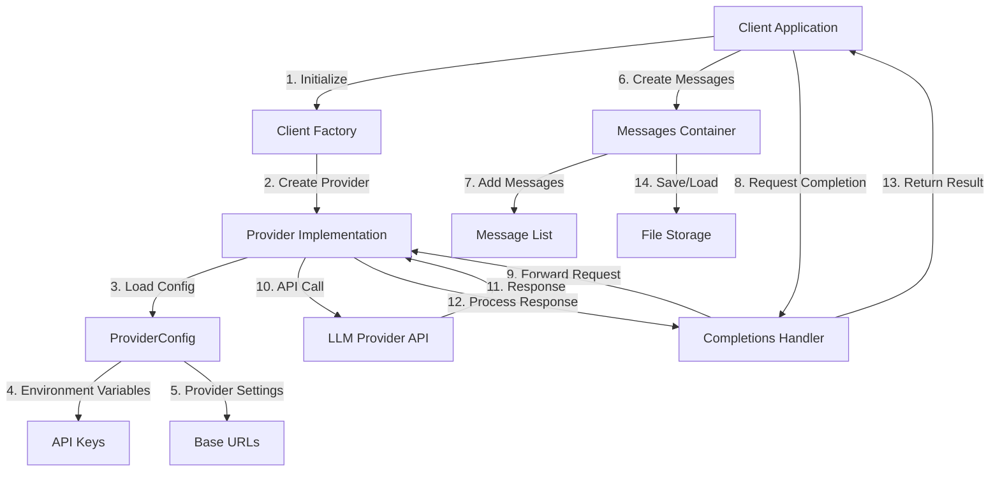

# Morality-AI API

This directory contains the API implementations for the Morality-AI project, including LLM (Large Language Model) and database APIs.

## Directory Structure

```
scr/api/
├── llm_api/           # Language Model API implementations
│   ├── providers/     # Different LLM provider implementations
│   ├── client.py      # Client factory
│   ├── config.py      # Configuration management
│   ├── completions.py # Completion handling
│   └── messages.py    # Message management
└── db_api/           # Database API implementations
```

## LLM API Architecture



## LLM API Usage

The LLM API provides a simple interface to interact with different language model providers (currently supporting DeepSeek).

### Basic Usage

```python
from scr.api.llm_api.client import get_client
from scr.models.prompt_manager.messages import Messages
from scr.api.llm_api.completions import get_completions

# Set provider info
provider = "deepseek"
model = "deepseek-chat"

client = get_client(provider)
messages = Messages()
#initialize the conversation
messages.append("assistant", "You are a helpful assistant. ")
messages.append("user", "What's the weather like in Paris today? return the weather in JSON format.")
response = get_completions(client, messages, model)
messages.append("assistant", response)

messages.append("user", "translate to Chinese.")
response = get_completions(client, messages, model)
messages.append("assistant", response)

messages.append("user", "what is your next step?")
response = get_completions(client, messages, model)
messages.append("assistant", response)

messages.append("user", "what is your next step?")
response = get_completions(client, messages, model)
messages.append("assistant", response)

# Save the conversation to a file
messages.save_json("convo_checkpoint")
messages.save_markdown("convo_checkpoint")
```

### Features

- **Multiple Provider Support**: Currently supports DeepSeek, with extensible architecture for adding more providers
- **Conversation Management**: Easy message handling with save/load capabilities
- **JSON Response Format**: All responses are formatted as JSON objects
- **Streaming Support**: Optional streaming responses for real-time output

### Configuration

The API uses environment variables for configuration:

```bash
# For DeepSeek
DEEPSEEK_API_KEY=your_api_key_here
```

### Message Format

Messages are stored in a list of dictionaries with the following format:
```python
{
    "role": "assistant" | "user",
    "content": "message content"
}
```

### Error Handling

The API includes comprehensive error handling for:
- Invalid provider configurations
- API connection issues
- Invalid model specifications
- Response parsing errors

## Database API

The `db_api` directory contains database-related implementations. (Documentation to be added as features are implemented)

## Contributing

When adding new providers:
1. Create a new provider class in `llm_api/providers/`
2. Implement the required interface from `BaseProvider`
3. Add provider configuration in `config.py`
4. Update the client factory in `client.py`

## License

[Add your license information here] 